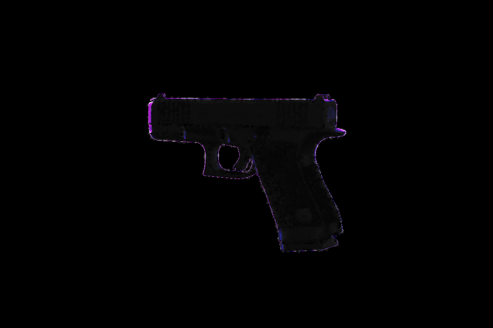

# Digitally Reverse Engineering a G19 Gen 6

# Overview

Glock.com has a neat 3d viewer that provides 120 photos.

Is it possible to use those photos to create a 3d model?

## Steps

1. Generate the URL set
2. Download the photos
3. Generate the 3D model

## Tools

- [Firefox](https://firefox.com)
- [Meshroom](https://alicevision.org/)
- [Docker](https://www.docker.com/)

## Analysis

- First 24 photos are very close to the following 24 photos, so I just skip them.
- Angles of 15 degrees
- Tilts of 20 degrees
- Slide size reference of 174mm, 463px

Assuming focal length of 35mm and sensor size of 36mm x 24mm.
(174mm * 35mm * 1100px) / (463px * 36mm) = 401.9mm
Let's just assume 400mm.

| tilt/rotation | 0 | 15 | 30 | 45 | 60 | 75 | 90 | 105 | 120 | 135 | 150 | 165 | 180 | 195 | 210 | 225 | 240 | 255 | 270 | 285 | 300 | 315 | 330 | 345 |
| --- | --- | --- | --- | --- | --- | --- | --- | --- | --- | --- | --- | --- | --- | --- | --- | --- | --- | --- | --- | --- | --- | --- | --- | --- |
| 0 | 024.png | 025.png | 026.png | 027.png | 028.png | 029.png | 030.png | 031.png | 032.png | 033.png | 034.png | 035.png | 036.png | 037.png | 038.png | 039.png | 040.png | 041.png | 042.png | 043.png | 044.png | 045.png | 046.png | 047.png |
| 20 | 048.png | 049.png | 050.png | 051.png | 052.png | 053.png | 054.png | 055.png | 056.png | 057.png | 058.png | 059.png | 060.png | 061.png | 062.png | 063.png | 064.png | 065.png | 066.png | 067.png | 068.png | 069.png | 070.png | 071.png |
| 40 | 072.png | 073.png | 074.png | 075.png | 076.png | 077.png | 078.png | 079.png | 080.png | 081.png | 082.png | 083.png | 084.png | 085.png | 086.png | 087.png | 088.png | 089.png | 090.png | 091.png | 092.png | 093.png | 094.png | 095.png |
| 60 | 096.png | 097.png | 098.png | 099.png | 100.png | 101.png | 102.png | 103.png | 104.png | 105.png | 106.png | 107.png | 108.png | 109.png | 110.png | 111.png | 112.png | 113.png | 114.png | 115.png | 116.png | 117.png | 118.png | 119.png |

## Results

### Meshroom

The initial low effort prototype using meshroom's "photogrametry + object turntable" pipeline.

### Voxel

Binary voxel carve approach. Captures the most detail but loses information from glares.

> Low detail A

> Low detail B

> High detail

Voting approach. Sacrifices detail for more complete shape.

> Voting front

> Voting right A

> Voting right B

# Conclusion

It is possible to create a 3d model of the pistol using only the photos provided via glock.com.

I was really impressed with the results of the voxel carving approach. It was able to capture a lot of detail from the pistol. Binary carving is a very powerful technique, but it is very sensitive to the quality of the input images.

# Future Work

- Improving segmentation would massively improve the 3d model
- Dialing in the camera parameters would improve the 3d model
- Improve the voting algorithm for the carving approach
- Continue the direction of using AI produced depth maps

# Fails

> Biblically accurate glock

> Glonk

# Unused photos

